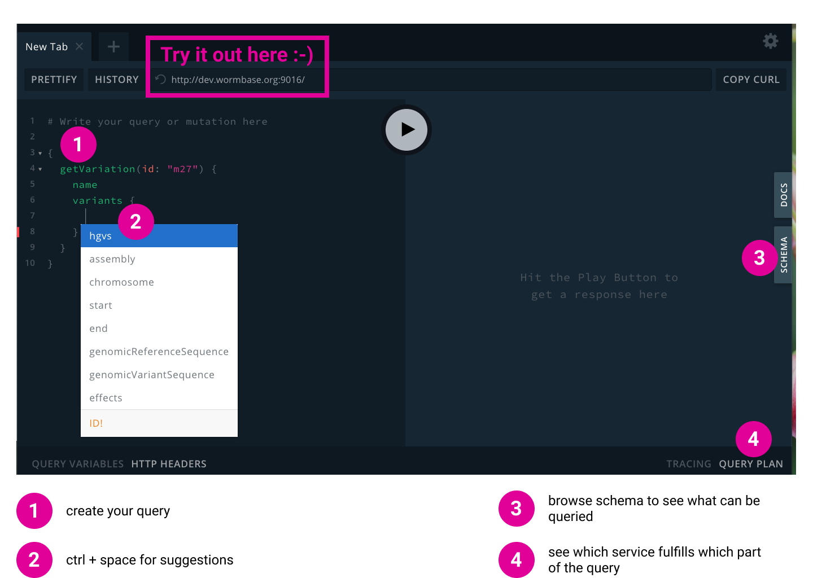
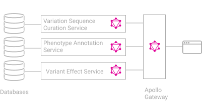

# graphql-federated-demo

Querying APIs in a microservices architecture and stitching responses is complicated and error-prone.

This proof-of-concept tries to address that.

The proposed solution uses [Apollo Federation](https://www.apollographql.com/docs/apollo-server/federation/introduction/) to compose multiple GraphQL enabled microservices into a single [GraphQL API](https://graphql.org/).

Both GraphQL and Apollo Federation are specifications with implementations in [most popular programming languages](https://www.apollographql.com/docs/apollo-server/federation/other-servers/).

The resulting GraphQL API can be explored using GraphQL Playground:



## Architecture Schematics



## Example Queries

If you were given a link to the GraphQL Playground of this project or have started a [development environment](#setup-development-environment), you can paste in one of the following queries as a starting point to explore data through the GraphQL API.

To learn more about GraphQL, please visit the [official site](https://graphql.org/).

```graphql
{
  getVariation(id: "m27") {
    id
    name
    variants {
      assembly
      hgvs
    }
  }
}
```

```graphql
{
  getVariation(id: "m27") {
    id
    name
    variants {
      hgvs
      assembly
      effects {
        Feature
        Codons
        Amino_acids
        Consequence
      }
    }
  }
}
```

```graphql
{
  getVariation(id: "m27") {
    id
    name
    variants {
      hgvs
      assembly
      effects {
        Feature
        Codons
        Amino_acids
        Consequence
      }
    }
    phenotypeAnnotations {
      phenotype {
        id
        name
      }
    }
  }
}
```

## Setup development environment

- Ensure Docker Engine 18.06.0+ and Docker Compose are installed.
- Set environment variables
    - AWS_ACCESS_KEY_ID  (required)
    - AWS_SECRET_ACCESS_KEY  (required)
    - FEDERATION_GATEWAY_PORT (optional)
    - FEDERATION_KIBANA_PORT (optional)
- Load the data (from AGR s3 bucket) with:
```
make start-ingest
```
- Once data has finished loading, visit http://localhost:[FEDERATION_GATEWAY_PORT] to explore the GraphQL API through GraphQL Playround, before terminating the process to release, potentially with:
```
make down
```
- Start GraphQL with already ingested data with:
```
make start
```
- Clean up ingested data to start fresh with:
```
make clean
```
